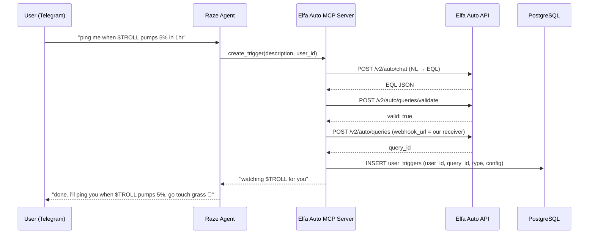
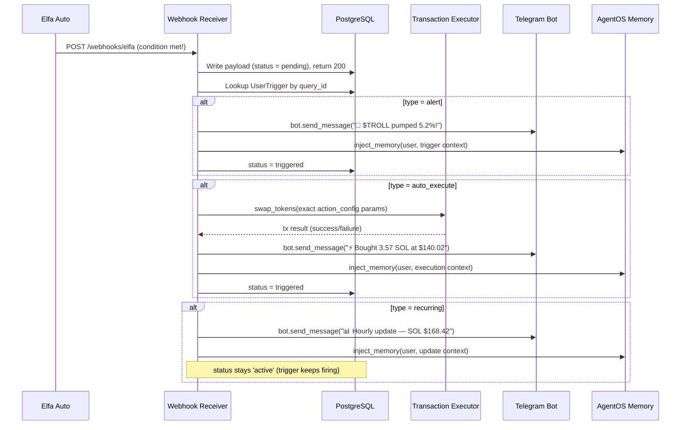

# Elfa Auto Integration — Triggers, Cron & Conditional Execution

**Date:** 2026-05-19
**Status:** Draft — architect + critic reviewed, notification architecture validated

## Problem

Raze users want to:
1. Set price alerts ("ping me when $TROLL pumps 5% in 1hr")
2. Get recurring updates ("update me about SOL price every hour")
3. Auto-execute trades on conditions ("buy $500 of SOL if it drops below $140")

The current price alert system polls Birdeye every 60s per alert — doesn't scale past ~50 alerts. No support for recurring updates or conditional execution.

## Solution

Use **Elfa Auto** (api.elfa.ai) as a managed condition engine. Elfa monitors conditions server-side and fires webhooks when met. Zero polling on our end. Verified working with Solana memecoins (SOL, TROLL, BONK, POPCAT, PEPE).

## Architecture

### Trigger Creation Flow (agent-mediated, user is chatting)



### Trigger Execution Flow (no agent — direct notification + memory injection)



### System Overview

```
+------------------+       +---------------------+       +------------------+
|                  |       |                     |       |                  |
|  User            |       |  Raze Agent         |       |  Elfa Auto MCP   |
|  (Telegram)      +------>|  (Claude Sonnet 4)  +------>|  Server          |
|                  |       |                     |       |  (port 8008)     |
+--------+---------+       +---------------------+       +--------+---------+
         |                                                         |
         |  (user replies                              Creates     |
         |   to notification                           queries     |
         |   -> normal agent                           via API     |
         |   conversation)                                         |
         |                                                         v
         |                                               +---------+---------+
         |                                               |                   |
         |                                               |  Elfa Auto        |
         |                                               |  (hosted service) |
         |                                               |  Monitors 24/7    |
         |                                               +--------+----------+
         |                                                        |
         |                    Webhook fires when                  |
         |                    condition is met                    |
         |                                                        v
         |                                               +--------+----------+
         |                                               |                   |
         |   Direct Telegram   <-------------------------+  Webhook Receiver |
         |   notification                                |  /webhooks/elfa   |
         |   + memory injection                          +---+------+-------+
         |                                                   |      |
         |                                                   |      |
         |                                          +--------+  +---+--------+
         |                                          |           |            |
         |                                          v           v            v
         |                                       Telegram   Transaction   AgentOS
         |                                       Bot API    Executor     Memory
         |                                       (notify)   (auto-swap)  (inject)
         +<-----------------------------------------+
              User sees notification on phone
```

## Components

### 1. Elfa Auto MCP Server
**Location:** `backend/mcp-servers/elfa-auto/server.py`
**Port:** 8008

**Tools:**
| Tool | Purpose | Elfa API |
|------|---------|----------|
| `create_trigger` | NL → EQL → validate → create → store in DB | /chat + /queries/validate + /queries |
| `list_triggers` | Show user's active triggers | DB query + /queries/{id} for status |
| `cancel_trigger` | Cancel an active trigger | /queries/{id}/cancel + DB update |
| `get_trigger_status` | Check a specific trigger | /queries/{id} |

**Key design decisions:**
- Uses Elfa's `/v2/auto/chat` endpoint for NL→EQL translation (we don't build our own parser)
- Webhook URL is set via `ELFA_WEBHOOK_URL` env var (points to our Railway webhook receiver)
- All Elfa API calls use `ELFA_API_KEY` from env
- Error messages are user-friendly, not raw API errors

### 2. Database — `user_triggers` table

```sql
CREATE TABLE user_triggers (
    id UUID PRIMARY KEY DEFAULT gen_random_uuid(),
    telegram_user_id BIGINT NOT NULL REFERENCES user_profiles(telegram_user_id),
    elfa_query_id VARCHAR(255) UNIQUE NOT NULL,
    trigger_type VARCHAR(20) NOT NULL,  -- 'alert', 'auto_execute', 'recurring'
    description TEXT NOT NULL,           -- original user prompt
    action_config JSONB,                 -- {action: 'swap', params: {from: 'USDC', to: 'SOL', amount: 500}}
    status VARCHAR(20) NOT NULL DEFAULT 'active',  -- 'active', 'triggered', 'cancelled', 'expired'
    elfa_query_json JSONB,              -- full EQL for debugging
    created_at TIMESTAMPTZ NOT NULL DEFAULT NOW(),
    triggered_at TIMESTAMPTZ,
    expires_at TIMESTAMPTZ
);

CREATE INDEX idx_user_triggers_user ON user_triggers(telegram_user_id);
CREATE INDEX idx_user_triggers_elfa ON user_triggers(elfa_query_id);
CREATE INDEX idx_user_triggers_status ON user_triggers(status);
```

### 3. Webhook Receiver — `/webhooks/elfa`
**Location:** `backend/services/webhook_receiver/server.py` (extend existing)

**Flow:**
1. Receive POST from Elfa with query execution payload
2. Extract `queryId` from payload
3. Look up `UserTrigger` by `elfa_query_id`
4. Dispatch based on `trigger_type`:
   - **alert**: Send Telegram notification with trigger details
   - **auto_execute**: Call transaction-executor internally, then notify user of result
   - **recurring**: Send notification, do NOT update status (trigger keeps firing)
5. Update `status` and `triggered_at` (for non-recurring)
6. Return 200 OK to Elfa

### 4. Agent Integration

**main.py:** Add `MCPTools` entry for elfa-auto on port 8008
**run_all.py:** Add to `MCP_SERVERS` list
**supervisord.conf:** Add `[program:mcp-elfa-auto]` section

**agent_prompt.py — new routing rules:**
```
IF user asks to set an alert, trigger, cron, schedule, or recurring update:
  → Use create_trigger from elfa-auto tools
IF user asks to list/show/check their alerts or triggers:
  → Use list_triggers
IF user asks to cancel/remove/delete an alert or trigger:
  → Use cancel_trigger
IF user asks "buy X if Y happens" or "sell X when Y":
  → Use create_trigger with auto_execute type
```

### 5. Elfa EQL Schema Reference

**Price alert (one-shot):**
```json
{
  "conditions": {
    "AND": [
      {"source": "price", "method": "current", "args": {"symbol": "SOL"}, "operator": ">=", "value": 200}
    ]
  },
  "actions": [{"stepId": "step_1", "type": "webhook", "params": {"url": "https://raze-webhook.up.railway.app/webhooks/elfa"}}],
  "expiresIn": "168h"
}
```

**Pump detection (recurring check):**
```json
{
  "conditions": {
    "AND": [
      {"source": "cron", "method": "every", "args": {"period": "1h"}},
      {"source": "price", "method": "change", "args": {"symbol": "TROLL", "period": "1h"}, "operator": ">=", "value": 5}
    ]
  },
  "actions": [{"stepId": "step_1", "type": "webhook", "params": {"url": "https://raze-webhook.up.railway.app/webhooks/elfa"}}],
  "expiresIn": "168h"
}
```

**Multi-token condition:**
```json
{
  "conditions": {
    "AND": [
      {"source": "cron", "method": "every", "args": {"period": "1h"}},
      {"source": "price", "method": "change", "args": {"symbol": "POPCAT", "period": "1h"}, "operator": ">=", "value": 5},
      {"source": "price", "method": "change", "args": {"symbol": "PEPE", "period": "1h"}, "operator": ">=", "value": 5}
    ]
  },
  "actions": [{"stepId": "step_1", "type": "webhook", "params": {"url": "https://raze-webhook.up.railway.app/webhooks/elfa"}}],
  "expiresIn": "168h"
}
```

## What this replaces

| Current system | New system |
|---|---|
| Price monitor polling Birdeye every 60s | Elfa monitors server-side, fires webhook |
| Max ~50 alerts before rate limits | 10,000+ alerts (Elfa's infra) |
| One-shot price alerts only | Price, %, TA indicators, Twitter signals, cron, LLM conditions |
| No auto-execution | Conditional swaps/sends via webhook → transaction-executor |
| No recurring updates | Cron-based recurring via Elfa |

## What we keep

- **Helius webhooks** for wallet activity alerts (different use case, already working)
- **Transaction executor MCP** for swap/send execution (webhook receiver calls it)
- **Telegram notifier** for proactive messages (webhook receiver uses it)

## Migration plan

1. Build new system alongside existing price alerts (no breaking changes)
2. New triggers go through Elfa Auto
3. Existing price alerts continue working via old system
4. Once Elfa system is proven in prod, deprecate the old price monitor service

## Env vars needed

```
ELFA_API_KEY=elfak_1e39934ad1e86180c609e4036f3a48859bc02bbe
ELFA_WEBHOOK_URL=https://raze-webhook.up.railway.app/webhooks/elfa
```

## Implementation order

1. **US-002** (DB schema) + **US-001** (MCP server) — parallel, foundation
2. **US-005** (NL→EQL via chat API) + **US-003** (webhook receiver) — parallel, core logic
3. **US-004** (agent wiring) — depends on 1+2
4. **US-006** + **US-007** (E2E tests) — depends on all above

## Cost estimate

Elfa Auto pricing is credit-based. From our validation tests, price conditions showed 0 estimated credits. LLM-evaluated conditions and Twitter signals cost more. For the alert/trigger use case (price conditions + cron), cost should be minimal.

## Notification Architecture (Validated via Architect + Critic Consensus)

**Decision: Direct notification + memory injection. No LLM in the trigger execution path.**

Reviewed 2026-05-19 by architect (Opus) and critic (Opus) independently. Both reached the same conclusion.

### Why NOT route through the agent

| Issue | Severity | Detail |
|---|---|---|
| Race conditions | Critical | 100 simultaneous triggers on same session_id = AgentOS session overwrites |
| Hallucination on swap params | Critical | Agent could change amounts, swap wrong tokens during auto-execute |
| Prompt injection | Major | User's original prompt injected into [SYSTEM TRIGGER] message = injection vector |
| Cost | Major | ~$0.01-0.03 per trigger × 10K/day = $100-300/day for formatted strings |
| Session collision | Critical | User chatting + trigger firing = interleaved context, leaked data |
| No retry | Major | Agent down = trigger silently lost |

### The pattern: direct notify + memory injection

Already proven in the codebase at `webhook_receiver/server.py:178-288` (wallet alerts):

```python
# 1. Send direct Telegram notification (fast, free, reliable)
await bot.send_message(chat_id=telegram_user_id, text=formatted_alert)

# 2. Inject memory so agent has context when user replies later
await inject_memory(
    user_id=user_id,
    memory_text=f"Trigger fired: {description}. {condition_met}. User was notified.",
    topics=["triggers", symbol]
)
```

When the user later replies "yeah buy it", the agent has the trigger context in memory and can act on it. Best of both worlds: fast notifications AND conversational context.

### Notification flow by trigger type

```
Elfa webhook → POST /webhooks/elfa
  → Write to DB immediately (status='pending'), return 200 to Elfa
  → Process asynchronously:
    │
    ├── type='alert':
    │   → Format template message with trigger data
    │   → bot.send_message(chat_id, formatted_alert)
    │   → inject_memory(user_id, trigger_context)
    │   → Update DB: status='triggered', triggered_at=now()
    │
    ├── type='recurring':
    │   → Format template message
    │   → bot.send_message(chat_id, formatted_update)
    │   → inject_memory(user_id, update_context)
    │   → Do NOT update status (trigger stays active)
    │
    └── type='auto_execute':
        → Call transaction-executor DIRECTLY with exact action_config params
          (no LLM interpretation — deterministic execution)
        → Format result message (success: tx hash + amounts, or failure: error)
        → bot.send_message(chat_id, execution_result)
        → inject_memory(user_id, execution_context)
        → Update DB: status='triggered', triggered_at=now()
```

### Notification templates

**Alert:**
```
🔔 Alert triggered

$TROLL pumped 5.2% in the last hour

price: $0.00847 (+5.2%)
volume 1hr: $1.2M

— you set this alert 42 minutes ago
```

**Auto-execute success:**
```
⚡ Auto-trade executed

Bought 3.57 SOL at $140.02
spent: 500 USDC
tx: 4f8a...confirmed ✓

— triggered by: "buy $500 of SOL if it drops below $140"
```

**Auto-execute failure:**
```
⚠️ Auto-trade failed

Condition met: SOL dropped to $139.80
But swap failed: insufficient USDC balance (have 12.50, need 500)

— trigger deactivated. set a new one when ready.
```

**Recurring update:**
```
📊 Hourly update — SOL

price: $168.42 (+2.1% 1hr)
24h volume: $4.2B
24h change: +5.8%

— next update in 1 hour
```

### Idempotency & retry

1. Write webhook payload to DB immediately with `status='pending'`, return 200 to Elfa
2. Process asynchronously from DB
3. If Telegram send fails, mark `status='pending_retry'`
4. Retry cron picks up `pending_retry` rows every 60s (max 3 retries)
5. Deduplicate by `elfa_query_id` + `triggered_at` to handle Elfa's own retries

### Where the agent IS used (and isn't)

| Action | Uses agent? | Why |
|---|---|---|
| Creating triggers (NL → EQL) | Yes | Agent parses "alert me when..." → Elfa query via MCP tool |
| Listing/cancelling triggers | Yes | Agent calls MCP tools |
| Firing alert notifications | No | Direct Telegram + memory injection |
| Firing auto-execute triggers | No | Direct transaction-executor call + Telegram notification |
| User replying to a notification | Yes | Normal agent conversation, trigger context in memory |

## Risks

1. **Elfa token coverage** — verified SOL, TROLL, BONK, POPCAT, PEPE work. Very new pump.fun tokens with no ticker recognition may not work. Fallback: tell user "this token isn't available for triggers yet."
2. **Webhook reliability** — Write to DB first, return 200, process async. Retry cron for failed notifications. Idempotent by elfa_query_id.
3. **Auto-execution safety** — deterministic execution with exact action_config params (no LLM interpretation). Require Unleashed subscription for auto-execute triggers. Cap maximum execution amount.
4. **Concurrent trigger fires** — direct notification handles concurrency trivially (no session state). Each trigger is independent.
5. **Prompt injection** — user text never enters agent context during trigger execution. Only during trigger creation (normal agent conversation, standard safeguards apply).
